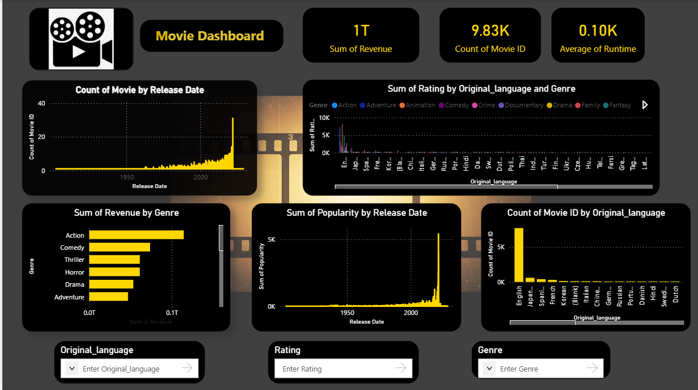
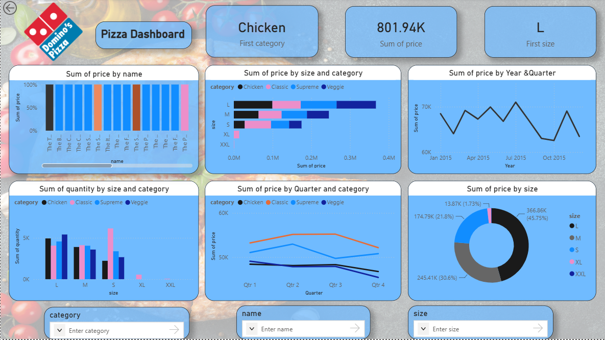

# 📊 Power BI Dashboard Portfolio

A collection of interactive Power BI dashboards created for data analysis, visualization, and business insights.

## 🚀 Projects

### 👥 HR Analytics Dashboard

Analyzes employee attrition and workforce trends.

**Key Insights:**
- Total Employees
- Attrition Count & Attrition Rate
- Average Age & Salary
- Attrition by Department
- Attrition by Job Role
- Attrition by Gender
- Attrition by Overtime
- Attrition by Age Group
- Job Satisfaction

**Tools:** Power BI, DAX, Excel

---

### 🛒 Amazon Sales Dashboard

Analyzes Amazon sales performance and business metrics.

**Key Insights:**
- Total Sales
- Total Orders
- Sales by Category
- Sales by Product
- Sales by Region
- Sales Trends

**Tools:** Power BI, DAX

---

### 🎬 Movie Analytics Dashboard

Analyzes movie revenue, ratings, popularity, runtime, genres, and languages.

**Key Insights:**
- Total Revenue
- Movie Count
- Average Runtime
- Revenue by Genre
- Movies by Release Date
- Movie Ratings
- Popularity Analysis

**Tools:** Power BI, DAX

---

### 🍕 Pizza Sales Dashboard

Analyzes pizza sales performance and customer ordering trends.

**Key Insights:**
- Total Revenue
- Total Orders
- Total Pizzas Sold
- Average Order Value
- Sales by Pizza Category
- Sales by Size
- Daily & Monthly Sales Trends
- Top-Selling Pizzas

**Tools:** Power BI, DAX

---

## 🛠️ Tools & Technologies

- Power BI
- DAX
- Microsoft Excel
- Data Visualization
- Data Analysis
- Business Intelligence

## 📁 Repository Contents

- `.pbix` — Power BI dashboard files
- `.png` — Dashboard preview images
- `README.md` — Project documentation

## 👨‍💻 Author

**Subramanyam**

Aspiring Data Analyst | Power BI Developer

⭐ If you find these dashboards useful, feel free to explore the repository.
